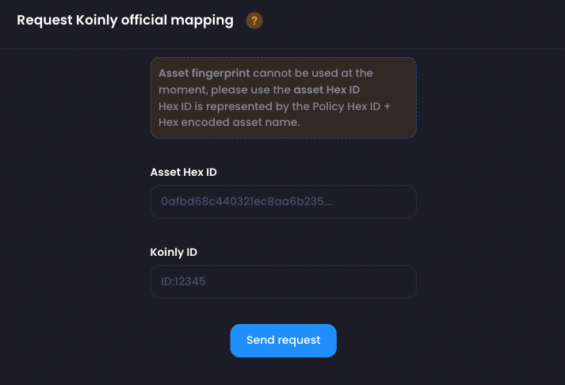

# Mapping

Mapping is a feature that associates a non-supported asset identifier to one or more platform specific ID.

With millions of different tokens and protocols, some identifier are likely to overlap and some are likely
to not be supported at all. Third party software need to provide a unique identifier for every different asset
and there is no central authority to keep these identifiers consistent among all services.

This is why Adastry incorporate its own mapping feature allowing to match cardano native assets with supported
third party identifiers.

## User Mapping

Every user have their own personal mapping. The mapping is auto-generated at export time when required.

Once an asset is attributed an ID/placeholder, this same ID will be used instead of the asset name at every
export. This is meant to make the asset recognizable by another software.

### User mapping for Koinly

Cardano Native assets actually falls in 2 distinct category on Koinly: Supported and Unsupported. 

For supported asset, see [Global mapping for Koinly](#global-mapping-for-koinly).

Unsupported assets need to be replaced by placeholders such as `NFT1` for NFTs and `NULL1` for tokens.
Adastry will automatically assign a placeholder to an asset if no official matching ID can be found within 
the global mapping. If an official ID is later added to the global mapping, a toggle button will be shown next
to the user mapped asset, thus allowing the user to switch to the official mapping.

:::caution

Overriding a user mapping with the official ID under global mapping will break the asset transaction history
on Koinly. When doing so, a user need to go through the Koinly history and manually update every occurrence
of the previous NFT\* or NULL\* placeholder with the right supported asset.

:::

## Global Mapping

The **Global Mapping** is shared among all Adastry users. This is where officially supported identifier should
be mapped to Cardano assets.

Global mapping can be requested through a [Mapping Request](#mapping-request). Proposed mapping needs to be 
reviewed for validity before activation. Once activated, the mapping will be automatically used when exporting
`CSV` for the associated third party service, ie: Koinly CSV format.

### Global mapping for Koinly

Supported assets will be given a numerical ID. They can be identified in CSV export using the prefix `ID:`
followed by their numerical identifier. ie: (**ID:12345**) Supported ID have to be manually added as
*Global Mapping*, making them unique and available to all Adastry users.

### Mapping Request

Request for official mapping can be done through the **Mapping Request Form**.
A different form will exist for every tax tool supported on Adastry.

:::note

Due to technical limitation, asset fingerprint cannot be used at the moment. 

Instead, the asset Hex ID need to be used on the request form.
Support for asset fingerprint will be added later on.

*Hex ID is represented by the Policy Hex ID + Hex encoded asset name.*

:::

### Request Koinly official mapping

To find an asset numerical identifier on Koinly, follow the following instructions:

1. Go to the Markets tab on Koinly (link currently located in the footer) and search
    for the token you want to import. Let's say that I wanted to import the World Mobile Token (WMT).
    
2. After clicking on the token you want, you will see the Koinly ID in the URL: https://app.koinly.io/p/markets/58284 .
3. You can now create the mapping request by using the following Koinly identifier: **ID:58284** .
