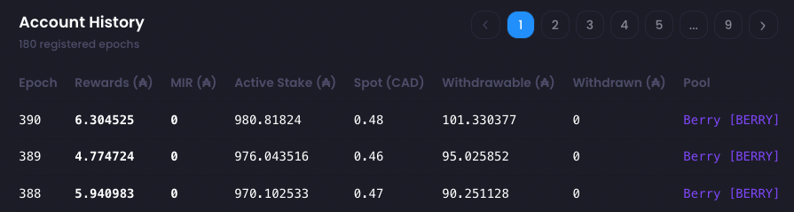

# Rewards History

The following documentation will provide additional information about account rewards history.

Each field presented on the rewards history page are defined bellow:

## Epoch

A Cardano epoch lasts 5 days. Calculation and events such as rewards distribution happen at the epoch
boundaries. Assuming that your account is delegated to a pool minting blocks at every epoch, you'll be
receiving rewards every 5 days. Depending on your local jurisdiction, these events can be treated as
**income**.

## Rewards

Rewards are payment received on an epoch basis for participating in the protocol consensus.
The **Rewards** field displays the total amount of rewards received from a pool at the start a given epoch,
*excluding MIR Rewards*.

:::tip

Keep in mind that the rewards are displayed along with the epoch they became available for withdraw to the
wallet owner. Those rewards are for blocks minted by the pool 2 epochs before.

:::

:::info

❗️ For SPO only: the **Rewards** field includes both stake rewards and operation fees. If one or more owner accounts differ
from the reward account, the following process applies:
- **Reward account:** display the real rewards and operation fees amount received by the account.
- **Owner accounts:** display rewards relative to the stake share of the account, plus the total fees divided by
  the number of owners.

See [Shared Pool](/learn/docs/services/shared-pool) for more information.

:::

## MIR

MIR stand for **"Move Instantaneous Rewards"**. These are special rewards moved from the treasury or reserve.
They are sent for different reason, ie: Catalyst voting rewards.

## Active Stake

Active Stake represents the amount of stake that will take part in the consensus protocol for the related epoch.
The account will receive rewards related to this amount 2 epochs later.

## Spot

Spot refers to ADA price in the user preferred currency at the beginning of the epoch, when rewards are received.

Preferred currency can be set using the top left dollar ($) sign icon.

## Withdrawable

Rewards accumulate in a special account and must be withdrawn to be spendable. Withdrawable history is calculated
using the known rewards history.

## Withdrawn

Withdrawn represents the amount of rewards that have been withdrawn during the epoch. Note that the rewards are not
spent, but added to the account balance.

## Stake Rewards (SPO Only)

Stake Rewards refer to calculated rewards share of the account, based on its stake share. The amount of this field
excludes the operation fees.

    Stake Rewards = (Pool Rewards excluding fees) * Stake Share
  

## Op Rewards (SPO Only)

Op Rewards refer to the account share of the pool operation fees. Pool fees are split evenly between all owners.
If you wish to split them on a stake share basis, it can be done manually using the calculated share percentage.

    Op Rewards = Pool Fees / Number of Owners

## Stake Share (SPO Only)

Stake Share is the calculated percentage representing the account stake on the total pool owners stake, including
the reward account.

    Stake Share = Account Stake / (Owner's Accounts Stake + Reward Account Stake)

See [Shared Pool > Stake Share](/learn/docs/services/shared-pool#stake-share) for more information about **Stake Share**. 
