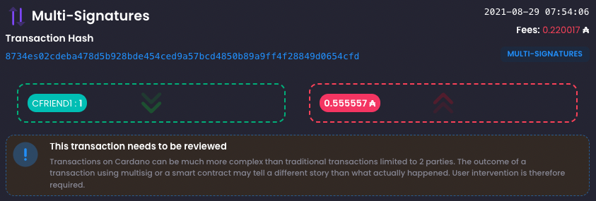
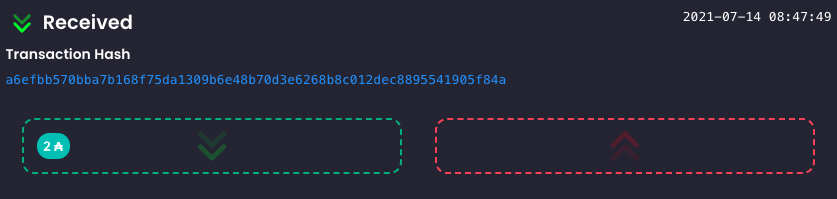
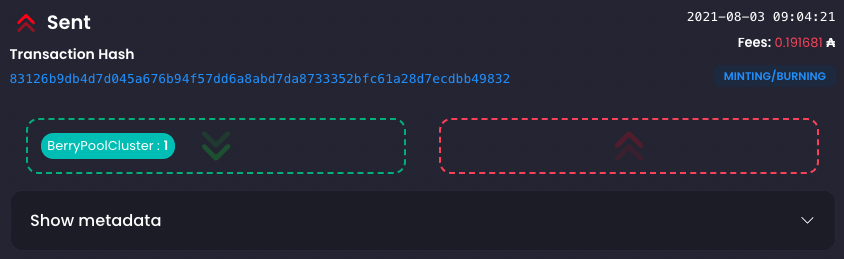

# Transactions History

The transactions history view aim to display transactions in a casual, easy to understand fashion.

:::info

Transactions on Cardano can be much more complex than traditional transactions limited to 2 parties.
The outcome of a transaction using multisig or a smart contract may tell a different story than what
actually happened. User intervention is therefore required.

:::

## Fees

Transaction fees are only displayed for **sent** and **multi-signature** transactions.
In the case of multisig transactions, the fees are displayed since it is impossible to determine which
party paid for them.

##### Received transaction example

##### Sent transaction example

## Multi-Signature

In the case of smart contract and multi-party transaction, the tax impact is more complicated to assess.
**Multi-Signatures** transactions need to be reviewed and manually adjusted to reflect the real intended transfer of assets
between each implicated parties.

Let consider the following situation:

    Alice, Bob and Charley engage in a transaction.
    Alice send Bob ₳20, Bob send ₳30 to Charley and Charley send ₳40 to Alice.

In the traditional world, we would have 3 transactions to describe the following situation. But on Cardano, all this
can happen in a single transaction for the sake of saving fees. The issue here is that the real intent can be
obscured in the resulting transaction.

In fact, this transaction could be written in a different way, with the same end result:

    Bob send ₳10 to Alice, Charley send ₳10 to Alice.

The issue is that the fiscal impact in the second transaction if far lesser than in the first one.
Which currently seems advantageous, but other situations could have the opposite effect.
